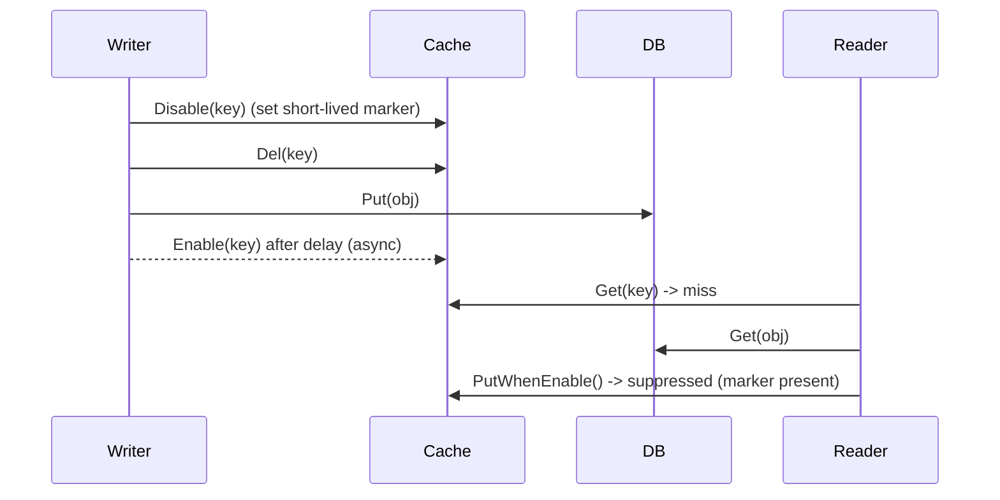

<div align="center">

# consistent_cache

**Cache-aside that does not lie to you.**

A small Go library that keeps a Redis cache and a relational database in sync across concurrent readers and writers — using a short-lived _disable marker_ instead of the classic "delete the key and hope" pattern.

[](https://go.dev)
[](go.mod)

</div>

---

## The problem

The usual cache-aside flow looks innocent:

```text
read  : cache.Get -> miss -> db.Get -> cache.Set
write : db.Put -> cache.Del
```

Under concurrency it races: a reader that missed the cache _before_ a write can fill it with the **stale** value _after_ the write deleted it. The cache then serves that stale value until the TTL expires. This package closes that window.



While the marker is set, read-path writes are suppressed, so a slow reader cannot repopulate the cache with a value that predates the write. Once the writes settle, the marker expires and the read path re-enables itself.

## Features

- **Read-path write suppression** — `Disable` / `Enable` gate cache population with a TTL'd marker, and `PutWhenEnable` writes only when the gate is open.
- **Delayed re-enable** — the write path re-enables the key asynchronously after a configurable delay, so in-flight reads drain first.
- **Anti-penetration sentinel** — missing rows are cached as `NullData`, so a hot miss never reaches the database twice.
- **TTL jitter** — `WithCacheExpireRandomMode()` spreads expiration between `1x` and `2x` the base TTL to avoid synchronized stampedes.
- **Storage-agnostic** — `Cache`, `DB`, `Object`, and `Logger` are interfaces; ships with Redis and MySQL/GORM adapters.
- **Cache-hit reporting** — `Get` returns `useCache`, which is exactly what you need to assert consistency in tests.

## Install

```bash
go get github.com/hangtiancheng/yukino.go/apps/consistent_cache
```

## Quick start

Implement `Object` for the record you want to cache. It is the only contract the library needs to serialize a row and to name its key column.

```go
type Article struct {
	ID    uint   `json:"id" gorm:"primarykey"`
	Slug  string `json:"slug" gorm:"column:slug"`
	Body  string `json:"body" gorm:"column:body"`
}

func (a *Article) KeyColumn() string { return "slug" }
func (a *Article) Key() string       { return a.Slug }
func (a *Article) Write() (string, error) {
	b, err := json.Marshal(a)
	return string(b), err
}
func (a *Article) Read(body string) error { return json.Unmarshal([]byte(body), a) }
```

Wire the adapters and use the `Service`:

```go
service := consistent_cache.NewService(
	redis.NewRedisCache(&redis.Config{Address: addr, Password: pass}),
	mysql.NewDB(dsn),
	consistent_cache.WithCacheExpireSeconds(120),
	consistent_cache.WithCacheExpireRandomMode(),
	consistent_cache.WithDisableExpireSeconds(1),
)

ctx := context.Background()

if err := service.Put(ctx, &Article{Slug: "hello", Body: "..."}); err != nil {
	log.Fatal(err)
}

art := Article{Slug: "hello"}
useCache, err := service.Get(ctx, &art)
if errors.Is(err, consistent_cache.ErrorDataNotExist) {
	// row genuinely does not exist (anti-penetration sentinel)
}
log.Printf("cached=%v body=%s", useCache, art.Body)
```

## API

### The `Service`

| Method                           | Behavior                                                                        |
| -------------------------------- | ------------------------------------------------------------------------------- |
| `NewService(cache, db, opts...)` | Build a service. `cache` and `db` are caller supplied.                          |
| `Put(ctx, obj)`                  | Disable read-path cache → delete key → persist to DB → schedule re-enable.      |
| `Get(ctx, obj)`                  | Cache first, fall back to DB, then repopulate only if the read path is enabled. |

`Get` returns `(useCache bool, err error)`:

- `useCache == true` and `ErrorDataNotExist` — the negative-cache sentinel was hit.
- `useCache == true` — served from cache.
- `useCache == false` — served from the database (and possibly repopulated).

### Options

| Option                        | Default       | Description                                           |
| ----------------------------- | ------------- | ----------------------------------------------------- |
| `WithCacheExpireSeconds(n)`   | `60`          | Base cache TTL.                                       |
| `WithCacheExpireRandomMode()` | off           | Add jitter of `[0, TTL)` to de-synchronize expiry.    |
| `WithDisableExpireSeconds(n)` | `10`          | Lifetime of the read-path disable marker.             |
| `WithEnableDelayMillis(n)`    | `1000`        | Delay before the write path re-enables the read path. |
| `WithLogger(l)`               | stdout logger | Diagnostic sink; implement `Logger`.                  |

### Contracts

- `Cache` — `Enable` / `Disable` / `Get` / `Del` / `PutWhenEnable`.
- `DB` — `Put` / `Get` over an `Object`.
- `Object` — `KeyColumn` / `Key` / `Write` / `Read`.
- `Logger` — `Errorf` / `Warnf` / `Infof` / `Debugf`.

## Adapters

| Package                  | Backend                                                                   |
| ------------------------ | ------------------------------------------------------------------------- |
| `consistent_cache/redis` | Redis (`go-redis`), with Lua for the atomic check-and-write.              |
| `consistent_cache/mysql` | MySQL via GORM, including `IsDuplicateEntryErr` for unique-key conflicts. |

## Testing

The `example/` package contains integration tests against real Redis and MySQL instances:

- `Test_consistent_Cache` — a single write/read round trip.
- `Test_Consistent_Cache_Correct` — 100 concurrent writers, then verifies value correctness and the exact expected cache-hit ratio.
- `Test_Consistent_Cache_Read_Write` — interleaved readers and writers on one key, asserting the disable mechanism forces every concurrent read to bypass the cache.

Fill in the connection constants at the top of `example/example_test.go`, then run:

```bash
go test ./example/...
```

## Notes

> [!NOTE]
> The read path never blocks on the write path. Correctness comes from _suppression_, not locking, so writes stay fast and readers degrade to the database instead of serving stale data.

> [!IMPORTANT]
> Configure `disableExpireSeconds` to comfortably exceed your slowest `Put`. If the marker expires while a write is still in flight, the read path can reopen early. The default `1s` re-enable delay plus a `10s` marker is conservative for most workloads.

## License

[MIT](../../LICENSE) © hangtiancheng
