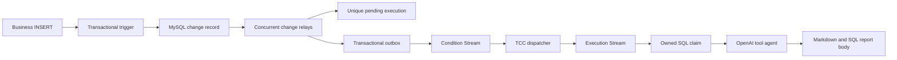

# Architecture

Taskflow is one deployable Go service. Every instance exposes the same HTTP API and runs schedulers, change relays, queue consumers, and recovery workers. Gorm/MySQL owns execution state. Redis provides fast claims, Streams, time-wheel shards, definition caches, node heartbeats, and diagnostic mirrors.

## Scheduled execution

1. The consistent-hash scheduler owner acquires a Redis lease.
2. It expands minute-resolution cron expressions in the task timezone for the configured planning window.
3. Every planned instant is inserted with a deterministic unique fire key and a prompt/model snapshot.
4. The distributed time wheel registers a callback. Its Lua pop is atomic and callback concurrency is bounded. The API rejects a future execution.
5. The dispatcher creates a TCC reserve/publish transaction. SQL conditional updates establish the transaction owner.
6. The execution consumer waits for confirmation and atomically claims queued to running for that owner.
7. The model calls tools and emits the required Markdown sections. Terminal persistence uses a separate bounded context so a deadline cannot erase the failure report.

The recovery sweep re-dispatches overdue pending rows and republishes commands for queued rows. Recovery keeps the original fire key and transaction ID. A running row is never automatically rerun.

## Conditional execution

A source UUID distinguishes separate insertions even if an auto-increment ID is reused. The source payload is captured before another actor can update or delete the business row. Audited deletion events support the daily comparison. Source changes are drained by explicit unprocessed rows rather than a monotonically increasing cursor, because IDs can commit out of order.

An uncertain XADD outcome can produce repeated delivery. The unique execution key and owned state transition absorb it. Execution state exists before publication, so reconciliation can recover even if Redis loses a published queue entry.

## Coordination boundaries

Redis locks limit duplicate coordination work. SQL constraints and conditional updates preserve execution ownership if a Redis lease expires or failover loses a fast claim. Read replicas never participate in these decisions.

The handwritten TCC monitor bounds recovery concurrency and uses a deadline shorter than its lock lease. Participant operations are idempotent. Confirm and cancel updates include the owning transaction ID.

The Bloom filter uses two Murmur3 positions in a 2 MiB daily bitmap and an expiration. A Bloom positive is always checked against the durable execution row. False positives cannot suppress new work.

Task definitions use consistent_cache. Reports use yukino_cache with a byte budget and expiration; the cluster overlay enables an etcd-discovered peer ring. Cache misses fall back to SQL. The execution-status mirror is eventually consistent, versioned, paginated, and retained independently of authoritative execution rows.

The LSM journal persists local audit records. Raft runs a single-member local ledger for ordered diagnostic decisions, with an explicit shutdown path. Neither substitutes for SQL ownership or database replication.

## Limits of the guarantee

One durable execution row can be claimed once. Completion cannot be guaranteed after a process crash or an uncertain external response. An operator-requested new run is a new execution. Restoring a database backup that omits execution history can also omit idempotency history; retain that history with the source data.

MySQL cluster deployment uses a primary and GTID replica, with explicit operator-controlled promotion. Redis Sentinel handles Redis primary promotion; pending/queued SQL rows recover lost coordination data. The supplied deployment does not implement multi-primary MySQL writes or automatic MySQL promotion.
