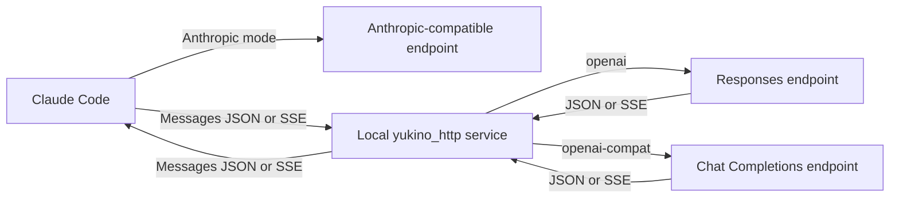

# yukino-agent-proxy

Run coding agents against providers from `~/.yukino/config.yaml`. A single
binary proxies either Claude Code or Codex, chosen with `--agent`. The CLI
starts a background service, backs up the agent's settings, and routes the
agent either directly or through a local protocol bridge.

| `--agent` | Agent       | Settings file   | Default listen    | Default state dir |
| --------- | ----------- | --------------- | ----------------- | ----------------- |
| `claude`  | Claude Code | `settings.json` | `127.0.0.1:17861` | `claude-proxy`    |
| `codex`   | Codex       | `config.toml`   | `127.0.0.1:17862` | `codex-proxy`     |

Claude Code exposes an Anthropic Messages surface. Codex exposes an OpenAI
Responses surface. Each agent accepts the same three upstream wire protocols:

| `--protocol`    | Upstream API            | Claude Code connection              | Codex connection                    |
| --------------- | ----------------------- | ----------------------------------- | ----------------------------------- |
| `anthropic`     | Anthropic Messages      | Directly to the configured provider | Through the local Responses bridge  |
| `openai`        | OpenAI Responses        | Through the local Messages bridge   | Forwarded to the Responses endpoint |
| `openai-compat` | OpenAI Chat Completions | Through the local Messages bridge   | Through the local Responses bridge  |

## Build

Requires Go 1.26.4 or newer on macOS, Linux, or Windows. The HTTP framework is
the sibling `yukino_http` module in the Yukino Go workspace.

From this directory:

```sh
go build -o bin/yukino-agent-proxy ./cmd/yukino-agent-proxy
# Optional: install the binary into GOBIN, or GOPATH/bin when GOBIN is unset.
go install ./cmd/yukino-agent-proxy
```

The parent `go.work` includes this module and `../yukino_http`. A local
`replace` also allows building with `GOWORK=off` while that sibling is present.
Build or install from the local checkout; a version-qualified remote
`go install ...@latest` cannot use the sibling replacement.

For all six platform artifacts, use Node.js 20 or newer:

```sh
node build.mjs
# Optional: choose the number of concurrent builds (default: up to three).
BUILD_CONCURRENCY=2 node build.mjs
```

The script works from any working directory and writes into this module's `bin`
directory:

```text
bin/yukino-agent-proxy-linux-x64
bin/yukino-agent-proxy-linux-arm64
bin/yukino-agent-proxy-darwin-x64
bin/yukino-agent-proxy-darwin-arm64
bin/yukino-agent-proxy-win32-x64
bin/yukino-agent-proxy-win32-arm64
bin/yukino-agent-proxy -> artifact for the current OS and architecture
```

`build.mjs` uses `@ts-check` and JSDoc types, disables CGO, limits each Go
build to two compiler processes by default, and uses the module's dependency
graph with `GOWORK=off` unless `GOWORK` is explicitly set. Failed builds retain
the previous artifact and do not update the native link. Windows uses a hard
link when symbolic links require additional privileges. The Windows artifacts
are PE executables with the exact filenames listed above; copy or rename the
selected artifact to `yukino-agent-proxy.exe` before running it on Windows.

To publish this proxy, authenticate with `gh auth login`, commit and push the
source, then run:

```sh
make release
```

The repository-root [release.js](../release.js) owns publishing. It builds the
project before changing GitHub. The release tag and title are fixed at the
binary name, and all six asset names have no version or timestamp suffix. An
existing release replaces same-name assets, updates the remote tag to the
current HEAD, and refreshes its metadata. A new release uses the same fixed
names. Native executable links are excluded. Push HEAD before publishing.

From the repository root:

```sh
# Build and publish the proxy.
node release.js
# Publish explicitly.
node release.js yukino-agent-proxy
# Build and inspect GitHub, then print planned writes without applying them.
node release.js --dry-run
# Test publishing behavior without accessing GitHub.
node --test release.test.js
```

The root package also provides `pnpm release` and `pnpm test:release`. The
script uses `@ts-check` and JSDoc types, works from any current directory, and
requires Node.js 20 or newer, Go, and an authenticated GitHub CLI. GitHub
lookup errors abort instead of being treated as missing releases.

## CLI

`--agent` selects the agent. When omitted it defaults to `claude`.

```sh
# Claude Code with providers[default_provider].
yukino-agent-proxy --agent=claude

# Codex with the first Anthropic provider.
yukino-agent-proxy --agent=codex --protocol=anthropic

# Select the first Responses provider.
yukino-agent-proxy --agent=claude --protocol=openai

# Select the first provider named ds-openai, regardless of its protocol.
yukino-agent-proxy --agent=codex --name=ds-openai

# Select the first Chat Completions provider whose name is ds-openai.
yukino-agent-proxy --agent=claude --protocol=openai-compat --name=ds-openai

yukino-agent-proxy --agent=claude status
yukino-agent-proxy --agent=claude shutdown
```

Both agents share a single background daemon per agent: the `claude` and
`codex` daemons use different state directories and listen ports, so they can
run at the same time.

Provider selection follows these four rules:

| Supplied filters  | Selected provider                                               |
| ----------------- | --------------------------------------------------------------- |
| Only `--protocol` | First provider matching that protocol                           |
| Only `--name`     | First provider matching that name, across protocols             |
| Both              | First provider matching both protocol and name                  |
| Neither           | `providers[default_provider]`, with the index defaulting to `0` |

Names may repeat, including within the same protocol. Array order determines
the first match. `default_provider` must be an integer; a negative or
out-of-range index is rejected when default selection is used. An empty
provider list, a missing match, or an invalid selected configuration causes a
nonzero exit. The CLI does not skip an invalid first match or silently choose
another provider.

Every start checks the selected inference endpoint, credentials, and model
before changing settings or stopping an existing service. The check sends one
small streaming request with a small output budget, stops after the first valid
event, and times out after ten seconds (twenty for Codex). A gateway returning
JSON instead is also accepted. This check can incur a small API charge.
Connection, authentication, HTTP, and invalid-response errors cause startup to
fail while retaining the current service and agent settings.

Starting the same provider again returns the current status without making
another backup. Selecting a different provider stops the old service and starts
the new one. Configuration changes take effect on the next start. Restart the
agent after switching so that its process loads the updated environment.

Optional flags:

| Flag           | Default                                                                           | Purpose                                            |
| -------------- | --------------------------------------------------------------------------------- | -------------------------------------------------- |
| `--agent`      | `claude`                                                                          | Agent to proxy: `claude` or `codex`                |
| `--config`     | `$HOME/.yukino/config.yaml`                                                       | Provider configuration                             |
| `--agent-dir`  | Claude: `$CLAUDE_CONFIG_DIR`/`$HOME/.claude`; Codex: `$CODEX_HOME`/`$HOME/.codex` | Agent settings directory                           |
| `--state-dir`  | `$HOME/.yukino/claude-proxy` or `$HOME/.yukino/codex-proxy`                       | Process state, lock, and log directory             |
| `--listen`     | `127.0.0.1:17861` (claude), `127.0.0.1:17862` (codex)                             | Loopback IP and port; port `0` chooses a free port |
| `--foreground` | `false`                                                                           | Run in the foreground; stop with Ctrl-C            |

Flags may appear before or after a subcommand. Use the same `--agent` and
`--state-dir` for commands controlling the same service. A state directory
belonging to the other agent is rejected. `--config` does not change the default
state directory.

For Claude Code, even direct Anthropic mode starts the local service for status
and shutdown control; Claude Code sends inference requests directly to the
upstream endpoint in this mode. For Codex, every request flows through the
local Responses gateway.

## Configuration

Only the ordered `providers` list is used. Other Yukino configuration sections
are ignored. See [config.example.yaml](config.example.yaml).

```yaml
default_provider: 0

providers:
  - name: ds-anthropic
    protocol: anthropic
    base_url: https://api.deepseek.com/anthropic
    model: deepseek-flash
    api_key: ${DEEPSEEK_API_KEY}

  - name: ds-openai
    protocol: openai-compat
    base_url: https://api.deepseek.com
    model: deepseek-flash
    api_key: ${DEEPSEEK_API_KEY}
    thinking: high
    max_output_tokens: 128000
```

`name`, `protocol`, `base_url`, and `model` are required for a selected
provider. `api_key` accepts environment expansion. An absent key falls back to
`ANTHROPIC_API_KEY` for Anthropic or `OPENAI_API_KEY` for either OpenAI
protocol.

`max_output_tokens` caps requests handled by the local bridge. `thinking`
accepts effort strings or YAML booleans. The legacy Claude defaults `enabled`
and `adaptive` map to `high`; effort strings are case-insensitive. Explicit
request settings take precedence over that default.

For OpenAI protocols, a host-only base URL receives `/v1`; an existing path is
preserved. A full `/responses` or `/chat/completions` endpoint is also
accepted. For direct Anthropic mode (Claude Code), use the provider's Anthropic
base URL, such as `/anthropic`, without the `/v1/messages` endpoint suffix.

## Settings and backups

Before each actual switch, the CLI copies the original settings bytes to a
timestamped backup next to the agent's settings file:

```text
~/.claude/settings.json.yukino-claude-proxy.<UTC timestamp>.bak   # claude
~/.codex/config.toml.yukino-codex-proxy.<UTC timestamp>.bak       # codex
```

For Claude Code the CLI preserves unrelated settings and environment entries,
removes conflicting authentication and cloud routing settings, and sets the
base URL and model aliases. For Codex it writes a `yukino-codex-proxy` model
provider, points `model_provider` and `model` at it, and emits a model catalog.
In both cases the upstream key stays out of the agent's settings file; Codex
uses a local placeholder bearer token, and Claude Code uses a local placeholder
token unless direct Anthropic mode writes the selected provider key for the
direct connection. Settings, backups, logs, and state files use mode `0600` on
POSIX systems; Windows access is governed by the configuration directory's
ACLs.

The existing backup prefixes, Codex provider ID and catalog filename, and
per-agent state directories are retained for compatibility with configurations
created by the former standalone proxies. The executable for both agents is
now `yukino-agent-proxy`; old `--claude-dir`/`--codex-dir` overrides become
`--agent-dir`.

**Shutdown leaves settings and backups unchanged.** The agent will keep pointing
at the stopped local service until you start it again or restore a backup. The
status output includes the backup path. A missing original settings file is
backed up as an empty document.

To restore manually, stop the service and copy the chosen backup over the
agent's settings file. Use the corresponding directory if `CLAUDE_CONFIG_DIR`
/ `--agent-dir` (Claude) or `CODEX_HOME` / `--agent-dir` (Codex) is set.

## MCP

Run the stdio MCP server with a default agent:

```sh
yukino-agent-proxy --agent=claude mcp
yukino-agent-proxy --agent=codex mcp
```

Example MCP client configuration:

```json
{
  "mcpServers": {
    "yukino-agent-proxy": {
      "command": "/absolute/path/to/yukino-agent-proxy",
      "args": ["--agent=claude", "mcp"]
    }
  }
}
```

The official Go MCP SDK exposes:

| Tool             | Input                                | Behavior                                                                                                    |
| ---------------- | ------------------------------------ | ----------------------------------------------------------------------------------------------------------- |
| `start_proxy`    | Optional `agent`, `protocol`, `name` | Apply the same four selection rules, check the connection, back up settings, and start or switch the service |
| `shutdown_proxy` | Optional `agent`                    | Stop the selected agent's service and retain settings and backups                                           |
| `proxy_status`   | Optional `agent`                    | Return agent, provider, model, PID, endpoint, and backup path                                                 |

Each tool accepts `agent: "claude"` or `agent: "codex"`. Omitting `agent`
uses the server's `--agent` (default `claude`); empty and unknown values are
rejected. The selection applies only to that call and does not change the
default for later calls. One MCP session can start, inspect, and stop both
agents independently. For example, call `start_proxy` with:

```json
{"agent": "codex", "protocol": "openai-compat", "name": "ds-openai"}
```

Use `{"agent": "codex"}` with `proxy_status` or `shutdown_proxy` to control
that daemon. Results identify the selected agent, including when it is stopped.

The server's `--config` is shared. When a call selects another agent, default
settings directories, state directories, and listen ports follow that agent.
Custom `--agent-dir`, `--state-dir`, and `--listen` values are retained across
calls; use the default state directories to run both agents concurrently.
The proxy survives the MCP session ending. Status and tool results exclude API
keys. Standard output carries MCP messages only; diagnostics go to standard
error or the daemon log.

## Protocol bridges

The Claude bridge translates Anthropic Messages to OpenAI wire protocols:



The Codex bridge translates OpenAI Responses to the selected upstream and back,
including a compaction route. Both bridges handle system instructions, text,
images, custom tool schemas, tool choice, parallel tool calls, tool results,
output limits, token usage, stop reasons, and upstream errors. They support
streamed and nonstreamed responses, including gateways that return JSON for a
streaming request or SSE for a nonstreaming request.

Current limits:

- Anthropic hosted tools, including server-side web search, are unsupported
  across the OpenAI bridges. Claude Code's client-side custom tools are
  supported.
- Chat Completions document inputs require text. Responses maps PDF inputs to
  `input_file`; the selected upstream must support that feature.
- Responses has no equivalent for Anthropic `stop_sequences`; these are omitted.
- `/v1/messages/count_tokens` is forwarded in Anthropic gateway mode and returns
  HTTP `501` for OpenAI protocols.
- OAuth providers, Gemini protocols, provider failover, and automatic retries
  are outside this tool's scope.

The local service binds only to a loopback IP. Administrative endpoints require
the private control token from the state file. Public routes include `/health`,
`/v1/models`, `/v1/messages` (Claude), and `/v1/responses` (Codex). Request
bodies are limited to 32 MiB and upstream requests to ten minutes. Stream
failures produce an error event instead of a successful terminal message.

## Development

```sh
go test ./...
go test -race ./...
go vet ./...

# Optional: small billable requests to real providers; never changes agent settings.
YUKINO_PROXY_LIVE_TEST=1 go test ./internal/claude/proxy -run '^TestLiveProviders$' -v -count=1

# Optional: run the installed Codex CLI against an isolated proxy and temporary
# configuration (requires the `codex` binary and real providers).
go test ./cmd/yukino-agent-proxy -run '^TestLiveCodex$' -args -live-codex -v -count=1
```

Tests cover provider selection, duplicate names, default indices, startup
connection failures, retained settings and services on failure, backups, real
SDK clients through mocked endpoints, background process switching, shutdown,
and MCP stdio for both agents. The opt-in live suites check startup
connectivity, text, SSE, and tool round trips against configured providers.

Implementation packages:

```text
cmd/yukino-agent-proxy    CLI entry point (--agent=claude|codex)
internal/agent            Agent registry, per-agent defaults and adapters
internal/config           Ordered provider selection
internal/claude           Claude Code settings, bridge, proxy, and route check
internal/codex            Codex settings, bridge, proxy, and route check
internal/daemon           Process lifecycle and authenticated local control
internal/mcpserver        Official MCP SDK tools
internal/private          Atomic private file writes
internal/upstream         Official Anthropic and OpenAI SDK transports
```
