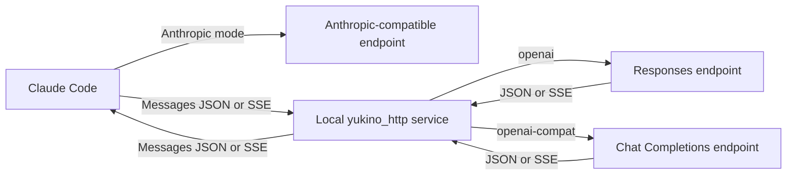

# yukino-claude-proxy

Run Claude Code against providers from `~/.yukino/config.yaml`. The CLI starts a background service, backs up Claude Code settings, and selects either a direct Anthropic endpoint or a local protocol bridge.

| `--protocol`    | Upstream API            | Claude Code connection              |
| --------------- | ----------------------- | ----------------------------------- |
| `anthropic`     | Anthropic Messages      | Directly to the configured provider |
| `openai`        | OpenAI Responses        | Through the local Messages bridge   |
| `openai-compat` | OpenAI Chat Completions | Through the local Messages bridge   |

## Build

Requires Go 1.26.4 or newer on macOS, Linux, or Windows. The HTTP framework is the sibling `yukino_http` module in the Yukino Go workspace.

From this directory:

```sh
go build -o bin/yukino-claude-proxy ./cmd/yukino-claude-proxy
# Optional: install the binary into GOBIN, or GOPATH/bin when GOBIN is unset.
go install ./cmd/yukino-claude-proxy
```

The parent `go.work` includes this module and `../yukino_http`. A local `replace` also allows building with `GOWORK=off` while that sibling is present. Build or install from the local checkout; a version-qualified remote `go install ...@latest` cannot use the sibling replacement.

For all six platform artifacts, use Node.js 20 or newer:

```sh
node build.mjs
# Optional: choose the number of concurrent builds (default: up to three).
BUILD_CONCURRENCY=2 node build.mjs
```

The script works from any working directory and writes into this module's `bin` directory:

```text
bin/yukino-claude-proxy-linux-x64
bin/yukino-claude-proxy-linux-arm64
bin/yukino-claude-proxy-darwin-x64
bin/yukino-claude-proxy-darwin-arm64
bin/yukino-claude-proxy-win32-x64
bin/yukino-claude-proxy-win32-arm64
bin/yukino-claude-proxy -> artifact for the current OS and architecture
```

`build.mjs` uses `@ts-check` and JSDoc types, disables CGO, limits each Go build to two compiler processes by default, and uses the module's dependency graph with `GOWORK=off` unless `GOWORK` is explicitly set. Failed builds retain the previous artifact and do not update the native link. Windows uses a hard link when symbolic links require additional privileges. The Windows artifacts are PE executables with the exact filenames listed above; copy or rename the selected artifact to `yukino-claude-proxy.exe` before running it on Windows.

To publish this proxy, authenticate with `gh auth login`, commit and push the source, then run:

```sh
make release
```

The repository-root [release.js](../release.js) owns publishing for both proxies. It builds every selected project before changing GitHub. Release tags and titles are fixed at the binary names, and all six asset names have no version or timestamp suffix. Existing releases replace same-name assets, update the remote tag to the current HEAD, and refresh their metadata. New releases use the same fixed names. Native executable links are excluded. Push HEAD before publishing.

From the repository root:

```sh
# Build and publish both proxies.
node release.js
# Publish just one proxy.
node release.js yukino-claude-proxy
node release.js yukino-codex-proxy
# Build and inspect GitHub, then print planned writes without applying them.
node release.js --dry-run
# Test publishing behavior without accessing GitHub.
node --test release.test.js
```

The root package also provides `pnpm release` and `pnpm test:release`. The script uses `@ts-check` and JSDoc types, works from any current directory, and requires Node.js 20 or newer, Go, and an authenticated GitHub CLI. GitHub lookup errors abort instead of being treated as missing releases. Remote publishing uses multiple API calls; an interrupted publish can be rerun to replace the same fixed assets.

## CLI

```sh
# Select providers[default_provider], with an omitted default_provider using 0.
yukino-claude-proxy

# Select the first Anthropic provider.
yukino-claude-proxy --protocol=anthropic

# Select the first Responses provider.
yukino-claude-proxy --protocol=openai

# Select the first provider named ds-openai, regardless of its protocol.
yukino-claude-proxy --name=ds-openai

# Select the first Chat Completions provider whose name is ds-openai.
yukino-claude-proxy --protocol=openai-compat --name=ds-openai

yukino-claude-proxy status
yukino-claude-proxy shutdown
```

Provider selection follows these four rules:

| Supplied filters  | Selected provider                                               |
| ----------------- | --------------------------------------------------------------- |
| Only `--protocol` | First provider matching that protocol                           |
| Only `--name`     | First provider matching that name, across protocols             |
| Both              | First provider matching both protocol and name                  |
| Neither           | `providers[default_provider]`, with the index defaulting to `0` |

Names may repeat, including within the same protocol. Array order determines the first match. `default_provider` must be an integer; a negative or out-of-range index is rejected when default selection is used. An empty provider list, a missing match, or an invalid selected configuration causes a nonzero exit. The CLI does not skip an invalid first match or silently choose another provider.

Every start checks the selected inference endpoint, credentials, and model before changing settings or stopping an existing service. The check sends one small streaming request with a 16-token output budget, stops after the first valid event, and times out after ten seconds. A gateway returning JSON instead is also accepted. This check can incur a small API charge. Connection, authentication, HTTP, and invalid-response errors cause startup to fail while retaining the current service and Claude settings.

Starting the same provider again returns the current status without making another backup. Selecting a different provider stops the old service and starts the new one. Configuration changes take effect on the next start. Restart Claude Code after switching so that its process loads the updated environment.

Optional flags:

| Flag           | Default                                         | Purpose                                            |
| -------------- | ----------------------------------------------- | -------------------------------------------------- |
| `--config`     | `$HOME/.yukino/config.yaml`                     | Provider configuration                             |
| `--claude-dir` | `$CLAUDE_CONFIG_DIR`, otherwise `$HOME/.claude` | Claude Code settings directory                     |
| `--state-dir`  | `claude-proxy` beside the selected config file  | Process state, lock, and log directory             |
| `--listen`     | `127.0.0.1:17861`                               | Loopback IP and port; port `0` chooses a free port |
| `--foreground` | `false`                                         | Run in the foreground; stop with Ctrl-C            |

Put flags after a subcommand when using `shutdown`, `status`, or `mcp`. Use the same `--state-dir` for commands controlling the same service. Existing shell environment variables and project-level Claude settings can override global settings; remove conflicting overrides when switching.

Even direct Anthropic mode starts the local service for status and shutdown control. Claude Code sends inference requests directly to the upstream endpoint in this mode.

## Configuration

Only the ordered `providers` list is used. Other Yukino configuration sections are ignored. See [config.example.yaml](config.example.yaml).

```yaml
default_provider: 0

providers:
  - name: ds-anthropic
    protocol: anthropic
    base_url: https://api.deepseek.com/anthropic
    model: deepseek-flash
    api_key: ${DEEPSEEK_API_KEY}

  - name: ds-openai
    protocol: openai-compat
    base_url: https://api.deepseek.com
    model: deepseek-flash
    api_key: ${DEEPSEEK_API_KEY}
    thinking: high
    max_output_tokens: 128000
```

`name`, `protocol`, `base_url`, and `model` are required for a selected provider. `api_key` accepts environment expansion. An absent key falls back to `ANTHROPIC_API_KEY` for Anthropic or `OPENAI_API_KEY` for either OpenAI protocol.

`max_output_tokens` caps requests handled by the local bridge. `thinking` accepts effort strings or YAML booleans. Explicit request settings take precedence over that default. Known OpenAI reasoning model families receive reasoning effort; the DeepSeek Chat endpoint receives `thinking`, and Qwen on Alibaba endpoints receives `enable_thinking`. Forced tool selection disables thinking for that request on those two Chat providers. Direct mode lets Claude Code and the upstream control request parameters.

When `context_window` is positive, the CLI writes its decimal value to `CLAUDE_CODE_MAX_CONTEXT_TOKENS` in Claude settings. This declares the context window for custom model IDs such as `deepseek-flash`, so Claude Code keeps proactive compaction at the configured window instead of assuming 200K tokens. Set the value to the actual window supported by your endpoint; there is no hard-coded provider default. An omitted or zero value clears the previous provider's window override and uses Claude Code's defaults. See the official [Claude Code context-window documentation](https://code.claude.com/docs/en/model-config#correct-the-window-for-a-gateway-or-custom-model-id) for how the override applies to recognized Claude IDs and `[1m]` names.

On Claude Code 2.1.288, declaring a custom model's window removes the long startup warning about an unknown window. A noninteractive `-p` invocation can still write `[claude-code:unrecognized_model]` to stderr; this is a catalog diagnostic and does not stop inference. The CLI does not add a `behavesAs` mapping or disable unknown-model window enforcement. Those settings change capability assumptions or compaction behavior, beyond declaring a provider's actual window.

Provider behavior follows the official [DeepSeek thinking documentation](https://api-docs.deepseek.com/guides/thinking_mode/), [DeepSeek Chat API reference](https://api-docs.deepseek.com/api/create-chat-completion/), and [Qwen function calling documentation](https://www.alibabacloud.com/help/en/model-studio/qwen-function-calling).

For OpenAI protocols, a host-only base URL receives `/v1`; an existing path such as `/compatible-mode/v1` or `/api/v1` is preserved. A full `/responses` or `/chat/completions` endpoint is also accepted. For direct Anthropic mode, use the provider's Claude Code base URL, such as `/anthropic`, without the `/v1/messages` endpoint suffix.

## Settings and backups

Before each actual switch, the CLI copies the original `settings.json` bytes to:

```text
~/.claude/settings.json.yukino-claude-proxy.<UTC timestamp>.bak
```

It preserves unrelated settings and environment entries, removes conflicting authentication and cloud routing settings, and sets the base URL and model aliases. OpenAI mode uses a local placeholder token; the upstream key stays out of the Claude settings file. Native mode writes the selected provider key into settings for the direct connection. Settings, backups, logs, and state files use mode `0600` on POSIX systems; Windows access is governed by the configuration directory's ACLs.

**Shutdown leaves settings and backups unchanged.** In OpenAI mode, Claude Code will keep pointing to the stopped local service until you start it again or restore a backup. The status output includes the backup path. A missing original settings file is backed up as an empty JSON object.

To restore manually, stop the service and copy the chosen backup:

```sh
yukino-claude-proxy shutdown
cp "$HOME/.claude/settings.json.yukino-claude-proxy.<chosen timestamp>.bak" \
   "$HOME/.claude/settings.json"
```

Use the corresponding directory if `CLAUDE_CONFIG_DIR` or `--claude-dir` is set. Choose the backup containing the configuration you want; later backups can contain an earlier proxy configuration.

## MCP

Run the stdio MCP server:

```sh
yukino-claude-proxy mcp
```

Example MCP client configuration:

```json
{
  "mcpServers": {
    "yukino-claude-proxy": {
      "command": "/absolute/path/to/yukino-claude-proxy",
      "args": ["mcp"]
    }
  }
}
```

The official Go MCP SDK exposes:

| Tool             | Input                       | Behavior                                                                                                     |
| ---------------- | --------------------------- | ------------------------------------------------------------------------------------------------------------ |
| `start_proxy`    | Optional `protocol`, `name` | Apply the same four selection rules, check the connection, back up settings, and start or switch the service |
| `shutdown_proxy` | `{}`                        | Stop the service and retain settings and backups                                                             |
| `proxy_status`   | `{}`                        | Return provider, model, PID, endpoint, and backup path                                                       |

For example, call `start_proxy` with `{"protocol":"openai-compat","name":"ds-openai"}` for the first matching pair, `{"name":"ds-openai"}` for the first matching name, or `{}` for the configured default index. MCP selection comes from the tool arguments; the server's `--config`, `--claude-dir`, `--state-dir`, and `--listen` flags provide its runtime paths and address. The proxy survives the MCP session ending. Status and tool results exclude API keys. Standard output carries MCP messages only; diagnostics go to standard error or the daemon log.

## Protocol bridge



The bridge handles system instructions, text, images, custom tool schemas, tool choice, parallel tool calls, tool results, output limits, token usage, stop reasons, and upstream errors. Mid-conversation `role: "system"` text messages, including those sent by Claude Code 2.1.288, retain their role and position in both OpenAI protocols. It supports streamed and nonstreamed responses, including gateways that return JSON for a streaming request or SSE for a nonstreaming request.

Text streams immediately. Tool arguments are buffered per call and emitted as sequential Anthropic blocks to keep parallel calls separate. Responses reasoning items retain their encrypted state in a proxy signature or redacted thinking block and are replayed on subsequent turns. Responses reasoning summaries are emitted when their output item completes. DeepSeek/MiMo Chat reasoning is preserved in assistant history.

Current limits:

- Anthropic hosted tools, including server-side web search, are unsupported across the OpenAI bridges. Claude Code's client-side custom tools are supported.
- Chat Completions document inputs require text. Responses maps PDF inputs to `input_file`; the selected upstream must support that feature.
- Responses has no equivalent for Anthropic `stop_sequences`; these are omitted. Chat Completions receives `stop`.
- `/v1/messages/count_tokens` is forwarded in Anthropic gateway mode and returns HTTP `501` for OpenAI protocols. The bridge does not claim an exact tokenizer for arbitrary models.
- OAuth providers, Gemini protocols, provider failover, and automatic retries are outside this tool's scope.

The local service binds only to a loopback IP. Administrative endpoints require the private control token from the state file. Public routes include `/health`, `/v1/models`, and `/v1/messages`. Request bodies are limited to 32 MiB and upstream requests to ten minutes. Stream failures produce an Anthropic error event instead of a successful terminal message.

## Development

```sh
go test ./...
go test -race ./...
go vet ./...

# Optional: small billable requests to real providers; never changes Claude settings.
YUKINO_PROXY_LIVE_TEST=1 go test ./internal/proxy -run '^TestLiveProviders$' -v -count=1

# Optional: run the installed Claude Code through an isolated proxy and
# temporary Claude configuration, using the first provider named ds-openai.
YUKINO_PROXY_CLAUDE_TEST=1 YUKINO_PROXY_LIVE_NAME=ds-openai \
  go test ./internal/proxy -run '^TestLiveClaudeCode$' -v -count=1
```

Tests cover all four selection modes, duplicate names, default indices, startup connection failures, retained settings and services on failure, backups, real SDK clients through mocked endpoints, mid-conversation system messages in JSON and SSE, parallel tool argument assembly, reasoning replay, truncated streams, cancellation, background process switching, shutdown, and MCP stdio. The opt-in live suite checks startup connectivity, text, SSE, and tool round trips against configured providers. The separate Claude Code test sends a small billable request using the installed CLI; `YUKINO_PROXY_LIVE_NAME` selects the first provider with that name, or its omission uses `default_provider`. Use `YUKINO_PROXY_LIVE_CONFIG` to choose another YAML file.

Implementation packages:

```text
cmd/yukino-claude-proxy   CLI entry point
internal/config         Ordered provider selection
internal/claude         Atomic settings updates and exact backups
internal/daemon         Process lifecycle and authenticated local control
internal/bridge         Request, response, and SSE conversion
internal/upstream       Official Anthropic and OpenAI SDK transports
internal/proxy          yukino_http routes and error handling
internal/mcpserver      Official MCP SDK tools
```
